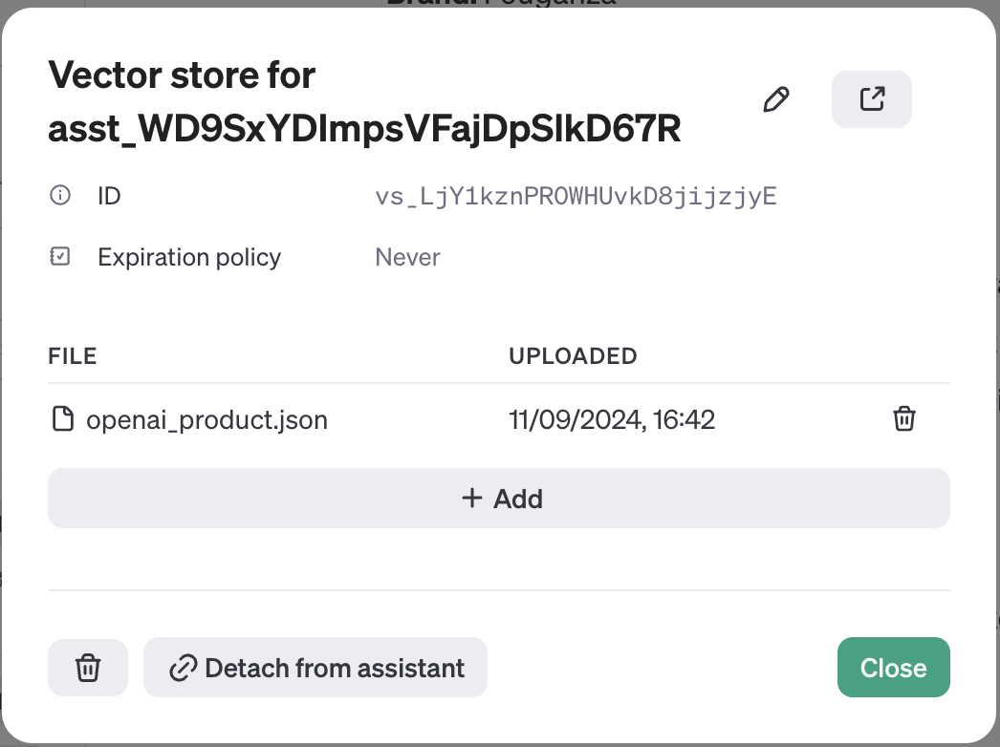

# AIssistant

Ever walked into a shop and started talking with the shop assistant to figure out what you wanted? With AIssistant, we aim to provide a seamless experience, helping you out with your shopping decisions.

## 📹 Team Demo

[To be updated]

## Pre-requisite

* OpenAI account with some credits
* Configured assistant, which can be created using the OpenAI Playground
* Upload existing products to the OpenAI Playground as a JSON file



Example of the file to upload: [products.json](data/import/common/DE/openai_product.json)

Set up the prompt as follows:

```
TBD
```


## Installation

1. Clone the repository
2. Install Spryker like a usual B2C demoshop
3. Provide the config

```
$config[AissistantConstants::OPENAI_API_KEY] = 'YOUR_OPENAI_API_KEY_HERE';
$config[AissistantConstants::ASSISTANT_ID] = 'ASSISTANT_ID_HERE';
```

4. Run the following command to install additional products

```
vendor/bin/console data:import --config=data/import/common/sports_setup.yml
```

## Caveats

* Currently the whole demoshop is commited to this repository, as an initial hackathon project. The extraction of the module is postponed to a later stage.
* There should be a special command / cronjob to update the products in the OpenAI Playground, as the products in the demoshop are updated.
* The response time is too long, and too many tokens are used. This should be optimized.